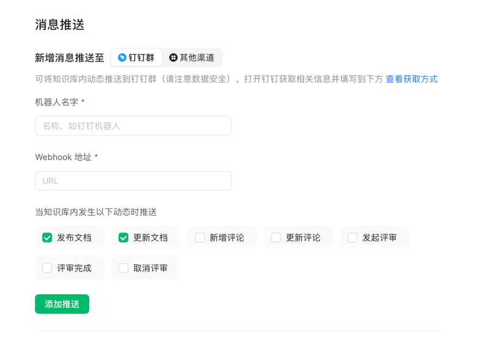

## 语雀-企微通知机器人
本工具使用效果与https://github.com/huhuhang/yuque-wecom-bot项目完全相同，可认为是其go语言重构版本。 

由于yuque-wecom-bot适配的是Cloudflare Workers，而该产品在国内访问可能存在网络问题。
所以本项目使用go语言重构，可部署到国内服务器，解决网络问题。可以直接部署到自有服务器或部署到腾讯云函数。

使用说明：

1.修改端口
在代码如下位置修改端口
```go
	http.ListenAndServe("0.0.0.0:5990", nil)
```
2.编译(release中的版本默认监听5990端口)
```cmd
GOOS=linux GOARCH=arm64 go build -trimpath -o yuquebot-linux-arm64 main.go
```

3.部署到服务器
```cmd
nohup ./yuquebot &
```

4.微信群添加企微机器人，获取机器人key yyyyyyyy-xxxx-xxxx-xxxx-c63ea73a8169

5.配置语雀webhook为http://ip:port/?key=yyyyyyyy-xxxx-xxxx-xxxx-c63ea73a8169


完事

